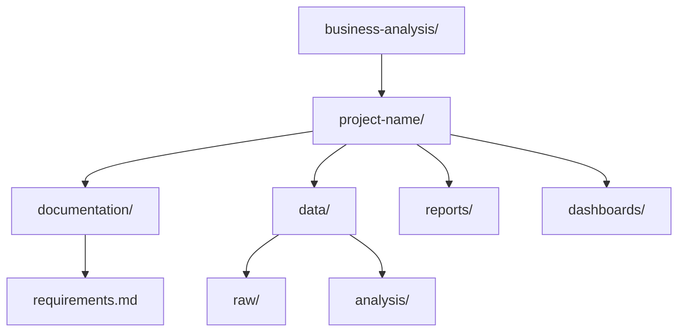

# Project Structure for BAs

## 1. Why This Matters
Organising your work as a BA makes it easy to share with stakeholders and track versions of requirements and reports.

## 2. Core Concept
A typical BA project folder:



```
business-analysis/
├── project-name/
│   ├── documentation/
│   │   ├── requirements.md
│   │   ├── findings.md
│   │   └── recommendations.md
│   ├── data/
│   │   ├── raw/
│   │   └── analysis/ (Excel files)
│   ├── reports/
│   │   ├── executive-summary.pptx
│   │   └── detailed-analysis.docx
│   ├── dashboards/
│   │   └── dashboard-specs.md
│   └── README.md
```

## 3. Real-World Examples
• A BA working on a new product launch keeps user stories in `documentation/` and market research data in `data/analysis/`.
• A quarterly business review folder contains slides and Excel models.

## 4. Comparison
| Folder | Content | Who uses |
|--------|---------|----------|
| documentation/ | Requirements, findings, recommendations | Team, stakeholders |
| data/ | Raw data and analysis files | BA, data team |
| reports/ | Presentations, Word docs | Executives, clients |
| dashboards/ | Specs for BI developers | Developers |

## 5. Decision Tree
1. Writing requirements? → `documentation/requirements.md`
2. Doing analysis in Excel? → `data/analysis/`
3. Presenting findings? → `reports/executive-summary.pptx`

## 6. Common Misconceptions
• BAs don't need a complex folder structure – simple is fine.
• Version control for documents is important – use `v1`, `v2` or a tool like SharePoint.

## 7. FAQ
**Q: Should I use Git for documents?** It's possible, but many BAs use SharePoint or Google Drive.
**Q: How to track changes in Word/Excel?** Use built-in version history (OneDrive, SharePoint).

## 8. Next Steps
Learn GitHub fundamentals (light) next.

## 9. Running Example
You'll create a folder for your real estate BI project. `documentation/` will contain the business questions and KPIs. `data/` will hold the dataset (maybe in Excel). `reports/` will have your final presentation to the investment committee.

## 10. Interview Prep
1. How do you ensure your findings are easy to find and understand?
2. What information would you put in a README for a business analysis project?

