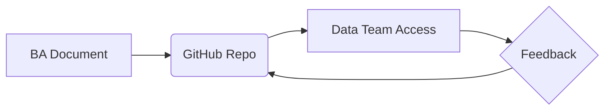

# GitHub for Business Analysts

## 1. Why This Matters
Even BAs may use GitHub to collaborate on documentation, track versions of analysis, or view data team's work.

## 2. Core Concept
**GitHub** is a platform to store and share files. BAs can use it to:

- Share requirements and reports with data teams
- Access analysis notebooks from data analysts
- Track changes to important documents (if using markdown)
No need for complex Git commands – use web interface or GitHub Desktop.

## 3. Real-World Examples
• A BA uploads a `requirements.md` file for a data science project.
• The BA reviews a Jupyter notebook from a data analyst and adds comments on GitHub.
• The BA downloads the latest version of a report from a shared repo.

## 4. Comparison
| Action | How to do it on GitHub |
|--------|------------------------|
| Create a file | Click 'Add file' → 'Create new file' |
| Edit a file | Click pencil icon, edit, commit |
| Upload a file | Drag and drop |
| Download a file | Right-click 'Save as' |
| See changes | 'History' tab |

## 5. Decision Tree
1. Need to share a document with a data team? → GitHub repo.
2. Want to keep a history of changes? → GitHub (or OneDrive).
3. Need to review technical work? → GitHub is great for markdown and notebooks.

## 6. Common Misconceptions
• You don't need to use the command line – the web interface is enough for BAs.
• GitHub is not just for code – it works for any text-based file (markdown, CSV, even PDFs).

## 7. FAQ
**Q: Do I need to learn Git?** Not for basic use – the web UI is fine.
**Q: Can I keep my documents private?** Yes, private repos are free.

## 8. Next Steps
Read about business metrics and KPIs.

## 9. Running Example
You'll create a GitHub repo for your real estate BI project. Upload your `requirements.md`, the dataset (if small), and your final presentation. Share the link with your team.

## 10. Interview Prep
1. How would you use GitHub to collaborate with a data analyst?
2. What are the advantages of storing requirements in a GitHub repo vs a shared drive?

