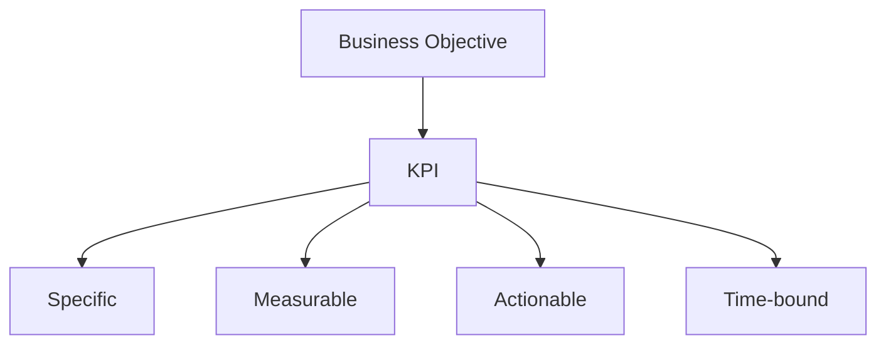

# Business Metrics & KPIs

## 1. Why This Matters
KPIs (Key Performance Indicators) are how businesses measure success. As a BA, you need to define and track the right metrics.

## 2. Core Concept
A **KPI** is a measurable value that shows progress toward a business objective. Good KPIs are:

- **Specific** to the goal
- **Measurable** with data
- **Actionable** (can influence)
- **Time-bound**
Examples: revenue, profit margin, customer acquisition cost, churn rate, average order value.

## 3. Real-World Examples
• E-commerce: conversion rate, cart abandonment rate.
• SaaS: monthly recurring revenue (MRR), customer lifetime value (LTV), churn.
• Real estate: average days on market, price per square foot, inventory turnover.

## 4. Comparison
| KPI category | Example | Formula |
|--------------|---------|---------|
| Financial | Gross margin | (Revenue - COGS) / Revenue |
| Customer | Retention rate | Customers at end / start |
| Operational | Days on market | Average listing duration |
| Sales | Win rate | Won deals / total opportunities |

## 5. Decision Tree
1. Want to know financial health? → revenue, margin, cash flow.
2. Want to understand customers? → retention, churn, NPS.
3. Want to measure efficiency? → cycle time, lead conversion.

## 6. Common Misconceptions
• Not every metric is a KPI – only those linked to strategic goals.
• Too many KPIs cause confusion – focus on 5-7 key ones.

## 7. FAQ
**Q: How often should KPIs be reviewed?** Weekly or monthly for operational, quarterly for strategic.
**Q: What if a KPI is hard to measure?** Consider a proxy or invest in tracking.

## 8. Next Steps
Read about data-driven decision making.

## 9. Running Example
For the real estate investment firm, KPIs might include: average return on investment (ROI) per property, inventory turnover (days on market), market share in luxury segment, and customer satisfaction score. You'll define these based on the firm's goals.

## 10. Interview Prep
1. Describe a KPI you've used to influence a business decision.
2. What would you do if a KPI is moving in the wrong direction?

