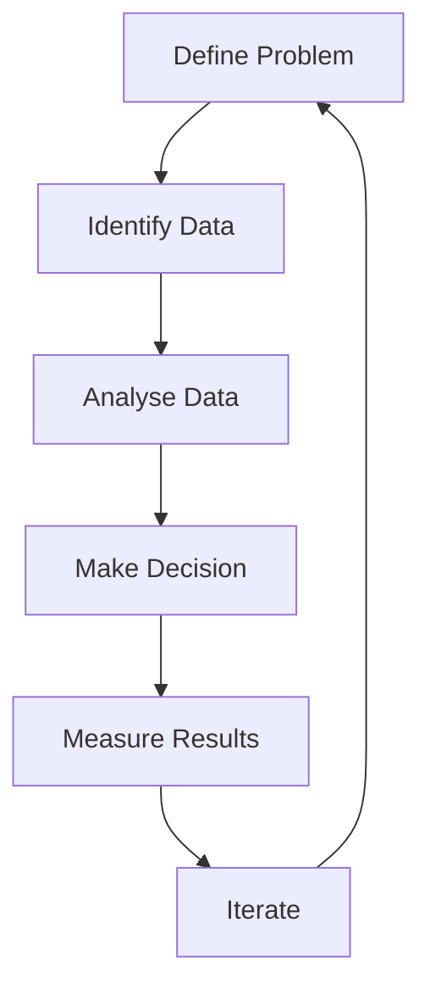

# Data-Driven Decision Making

## 1. Why This Matters
Decisions based on intuition alone are risky. Data-driven decisions reduce bias and improve outcomes.

## 2. Core Concept
Data-driven decision making (DDDM) is using facts, metrics, and analysis to guide business strategy. Steps:

1. Define the problem
2. Identify relevant data
3. Analyse data (descriptive, diagnostic, predictive)
4. Make a decision
5. Measure results
6. Iterate

## 3. Real-World Examples
• A retailer uses sales data to decide which products to discount.
• A logistics company analyses delivery times to reroute drivers.
• A real estate firm uses market trends to decide where to buy properties.

## 4. Comparison
| Decision type | Data needed | Examples |
|---------------|-------------|----------|
| Descriptive | Historical data | What happened? |
| Diagnostic | Detailed breakdown | Why did it happen? |
| Predictive | Patterns, models | What will happen? |
| Prescriptive | Advanced analytics | What should we do? |

## 5. Decision Tree
1. Need to understand a past event? → descriptive analytics.
2. Need to find root cause? → diagnostic.
3. Need to forecast? → predictive.
4. Need to optimise actions? → prescriptive.

## 6. Common Misconceptions
• Data-driven does not mean 'data-only' – domain expertise still matters.
• More data does not always lead to better decisions – focus on relevant data.

## 7. FAQ
**Q: How small a company can use DDDM?** Any size – even a coffee shop can track daily sales and weather.
**Q: What if data is imperfect?** Use sensitivity analysis and caveats.

## 8. Next Steps
Read about basic data analysis for business next.

## 9. Running Example
Problem: Should the firm invest in luxury homes? Data: historical luxury vs non-luxury ROI, market growth rates, customer demand surveys. Analysis: compare ROI and risk. Decision: invest 30% of budget in luxury. Results tracked over 2 years.

## 10. Interview Prep
1. Describe a time you made a data-driven decision that had a positive outcome.
2. What do you do when data contradicts your intuition?

