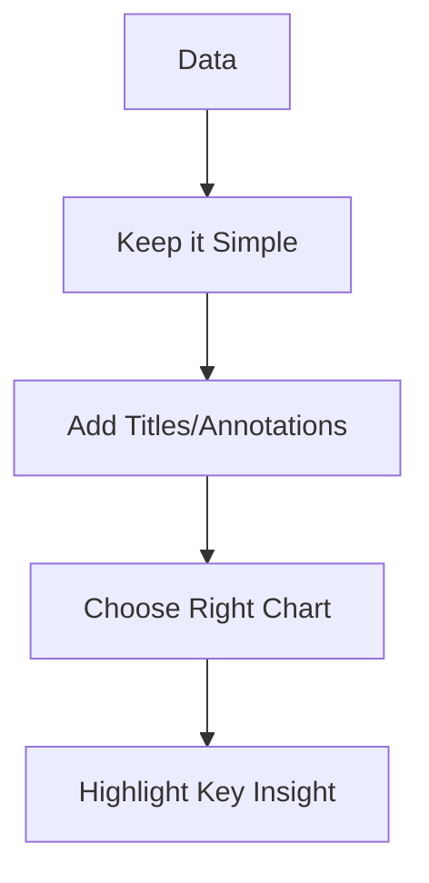

# Data Visualization for Stakeholders

## 1. Why This Matters
Stakeholders don't have time for complex tables. Visualisations help them understand insights quickly.

## 2. Core Concept
Best practices for stakeholder visuals:

- **Keep it simple**: one message per chart.
- **Use titles and annotations**: explain what they're seeing.
- **Avoid 3D and excessive colours**: clarity over flash.
- **Choose the right chart** (bar, line, pie only for simple part-to-whole).
- **Highlight the key insight** with colour or callout.

## 3. Real-World Examples
• A line chart showing monthly sales with an annotation for a marketing campaign.
• A bar chart comparing ROI by product category, with top category highlighted.
• A gauge chart for a KPI (e.g., customer satisfaction).

## 4. Comparison
| Stakeholder type | Preferred visual | Why |
|------------------|------------------|-----|
| Executive | High-level dashboards, trend lines | Need summary |
| Product manager | Funnel charts, cohort analysis | Detailed actions |
| Sales team | Maps, bar charts | Regional performance |
| Finance | Waterfall charts, tables | Precision |

## 5. Decision Tree
1. Showing progress toward a goal? → gauge, bullet chart.
2. Comparing categories? → bar chart.
3. Showing trends over time? → line chart.
4. Showing composition? → stacked bar (not pie if >2 categories).

## 6. Common Misconceptions
• Stakeholders do not want 'fancy' – they want clear.
• Always include a title and axis labels – don't assume they know.

## 7. FAQ
**Q: What tool is best for stakeholder dashboards?** Power BI or Tableau for interactive; Excel for static.
**Q: How many charts per page?** 3-5, each with a clear takeaway.

## 8. Next Steps
Read about business intelligence platforms.

## 9. Running Example
Create a one-page executive dashboard in Power BI: a line chart of median price over time, a bar chart of ROI by property type, a map of inventory by region, and a KPI card for average days on market. Add a callout: 'Luxury segment ROI 22% vs mid-tier 12%'.

## 10. Interview Prep
1. How would you visualise a decline in sales to a CEO?
2. What chart would you use to show market share of 5 competitors?

