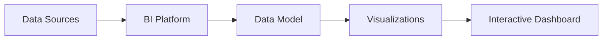

# Business Intelligence Platforms

## 1. Why This Matters
BI platforms (Power BI, Tableau, Looker) are the primary tools for BAs to create dashboards and share insights across the company.

## 2. Core Concept
**BI platforms** connect to data sources, allow data modelling, and provide interactive dashboards. Key features:

- Data connectors (SQL, Excel, cloud)
- Drag-and-drop visualisations
- Calculated fields and measures
- Row-level security
- Scheduled refresh
- Sharing and embedding

## 3. Real-World Examples
• A sales dashboard in Power BI that refreshes daily from a data warehouse.
• A Tableau story showing the impact of a pricing change.
• Looker embedded in a customer portal for self-service analytics.

## 4. Comparison
| Platform | Best for | Pros | Cons |
|----------|----------|------|------|
| Power BI | Microsoft shops | Cost-effective, good integration | Windows-heavy |
| Tableau | Complex visualisations | Beautiful, flexible | Expensive |
| Looker | Modern cloud stack | Git-based, strong governance | Requires LookML |
| Qlik | Associative engine | Powerful data exploration | Steep learning curve |

## 5. Decision Tree
1. Company uses Office 365? → Power BI.
2. Need advanced visualisation design? → Tableau.
3. Company uses BigQuery or Snowflake? → Looker.
4. Budget tight and need good enough? → Power BI Pro.

## 6. Common Misconceptions
• BI tools are not just for IT – BAs can build their own dashboards.
• You don't need to learn all platforms – choose one and become expert.

## 7. FAQ
**Q: Do I need to know SQL to use BI tools?** Basic SQL helps, but many have visual query builders.
**Q: How do I keep dashboards accurate?** Set up automated data refresh and data validation checks.

## 8. Next Steps
Start building your own dashboard using the running example.

## 9. Running Example
You'll build a complete BI dashboard in Power BI (or Tableau Public) for the real estate firm. Include:
- Home page with key KPIs
- Market trends page (price, days on market)
- Investment opportunities page (ROI by segment)
- Executive summary page with recommendations
Publish to Power BI Service and share with your 'stakeholders'.

## 10. Interview Prep
1. What is a calculated measure? Give an example.
2. How would you secure a dashboard so that managers only see their region?

