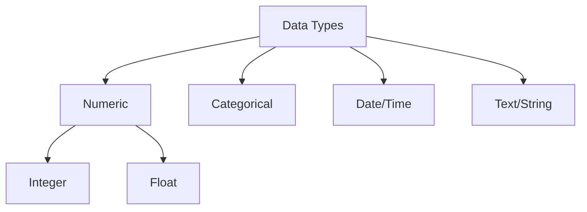

# Data Types & Handling

## 1. Why This Matters
Real data is messy – you need to know how to handle different data types (numeric, categorical, dates, text).

## 2. Core Concept
**Numeric**: integers and floats – can be aggregated (sum, average). **Categorical**: labels like 'house type' – can be counted and grouped. **Date/time**: time series analysis. **Text**: comments, descriptions – needs cleaning.

## 3. Real-World Examples
• Converting 'price' from string to numeric.
• Extracting month from a date column.
• Cleaning inconsistent categorical values ('NY' vs 'New York').

## 4. Comparison
| Data type | Operations | Example tools |
|-----------|------------|---------------|
| Numeric | sum, avg, median, std | SQL: AVG, SUM; Excel: AVERAGE |
| Categorical | COUNT, GROUP BY, pivot | SQL: GROUP BY; pivot tables |
| Date/time | extract year, month, day | SQL: EXTRACT; Python: datetime |
| Text | length, contains, replace | SQL: LIKE; Python: .str |

## 5. Decision Tree
1. Is it a number? → check for non-numeric values, then convert.
2. Is it a category? → standardise spelling, handle missing.
3. Is it a date? → parse to datetime, handle different formats.
4. Is it text? → clean whitespace, lowercasing, maybe extract keywords.

## 6. Common Misconceptions
• 'Categorical' data can look numeric (e.g., ZIP codes) – don't sum them.
• Missing values are not always 'bad' – sometimes they indicate something.

## 7. FAQ
**Q: What's the best way to handle missing values?** Depends: drop if few, impute with median/mode, or create 'missing' category.
**Q: How to detect data type issues?** Use `info()` in pandas or `DESCRIBE` in SQL.

## 8. Next Steps
Learn about project structure for analysts.

## 9. Running Example
In our real estate dataset, you'll:
- Convert `price` to numeric (already is).
- Treat `property_type` as categorical.
- Convert `year_sold` to a date.
- Extract `month_sold` to see seasonality.

## 10. Interview Prep
1. How would you handle a column with mixed types (e.g., '5', 'unknown')?
2. What is the difference between `object` and `category` dtypes in pandas?

