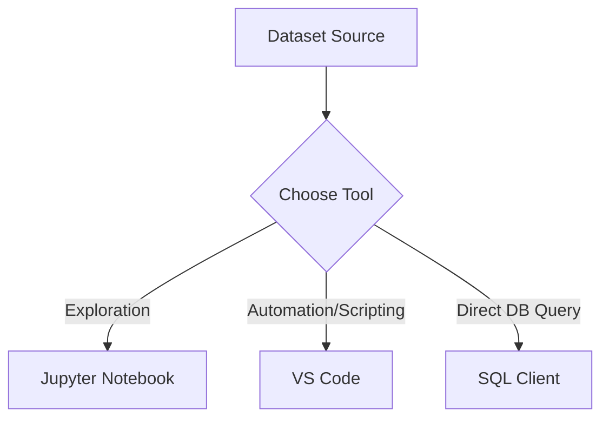

# IDE vs Jupyter for Analytics

## 1. Why This Matters
Choosing the right environment makes analysis faster. Most analysts use Jupyter for exploration and SQL clients for querying.

## 2. Core Concept
**Jupyter Notebook**: interactive, great for step-by-step exploration, combining code, text, and charts. **IDE (VS Code)**: better for writing reusable scripts and Python packages. **SQL clients (DBeaver, DataGrip)**: best for querying databases directly.

## 3. Real-World Examples
• Use Jupyter to clean a CSV and test visualisations.
• Use VS Code to write a Python script that automates report generation.
• Use DBeaver to write complex SQL queries against a data warehouse.

## 4. Comparison
| Feature | Jupyter | VS Code | SQL Client |
|---------|---------|---------|------------|
| Interactive exploration | Excellent | Good | No |
| SQL support | Limited (via magic) | Extensions | Excellent |
| Scripting & automation | Weak | Excellent | No |
| Version control | OK (with care) | Excellent | Not needed |

## 5. Decision Tree
1. Exploring a new dataset? → Jupyter.
2. Writing production code? → VS Code.
3. Querying a database? → SQL client.
4. Need to schedule a recurring analysis? → Python script in VS Code + cron.

## 6. Common Misconceptions
• You don't have to choose one – many analysts use Jupyter for development then convert to a script.
• Jupyter can be used for SQL via `%%sql` magic.

## 7. FAQ
**Q: Can I use Jupyter for large datasets?** Yes, but be careful with memory. Use sampling or connect to a database.
**Q: Is Google Colab good for analytics?** Yes, especially if you need free GPU or cloud storage.

## 8. Next Steps
Learn terminal basics (light).

## 9. Running Example
We'll use Jupyter Notebook for the initial EDA and visualisations. Then we'll export the cleaned data and use a SQL client to run more advanced queries (e.g., monthly price trends).

## 10. Interview Prep
1. When would you use Jupyter over a traditional IDE?
2. How do you refactor a Jupyter notebook into a Python script?

