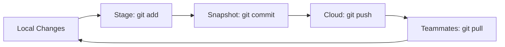

# GitHub for Data Analysts

## 1. Why This Matters
GitHub helps you track changes to your analysis, collaborate with team members, and build a portfolio.

## 2. Core Concept
**Git**: version control. **GitHub**: cloud hosting. For analysts: focus on `commit`, `push`, `pull`, and `README`. No need for complex branching initially.

## 3. Real-World Examples
• Save versions of your dashboard code.
• Share SQL queries with teammates.
• Show a recruiter your analysis project on GitHub.

## 4. Comparison
| Command | What it does | Analysts' use |
|---------|--------------|---------------|
| git add . | Stage changes | After you finish a notebook |
| git commit -m "msg" | Save snapshot | Describe what you changed |
| git push | Upload to GitHub | Share with team / public |
| git pull | Download latest | Get teammates' updates |

## 5. Decision Tree
1. Working alone on a project? Use basic commit/push.
2. Collaborating? Learn `git pull` and handle merge conflicts (rare for notebooks).
3. Want feedback from others? Make your repo public.

## 6. Common Misconceptions
• You don't need to be a Git expert – the basic 5 commands cover 90% of what analysts do.
• Jupyter notebooks can be version controlled, but avoid large outputs.

## 7. FAQ
**Q: Can I use GitHub without the command line?** Yes, GitHub Desktop or VS Code integration.
**Q: How to ignore large data files?** Add `data/raw/*.csv` to `.gitignore`.

## 8. Next Steps
Read about EDA next.

## 9. Running Example
You'll push your real estate analysis project to GitHub. Include a detailed `README.md` explaining the market insights. This becomes your portfolio project.

## 10. Interview Prep
1. How would you recover a previous version of your analysis?
2. What information should be in a README for an analysis project?

