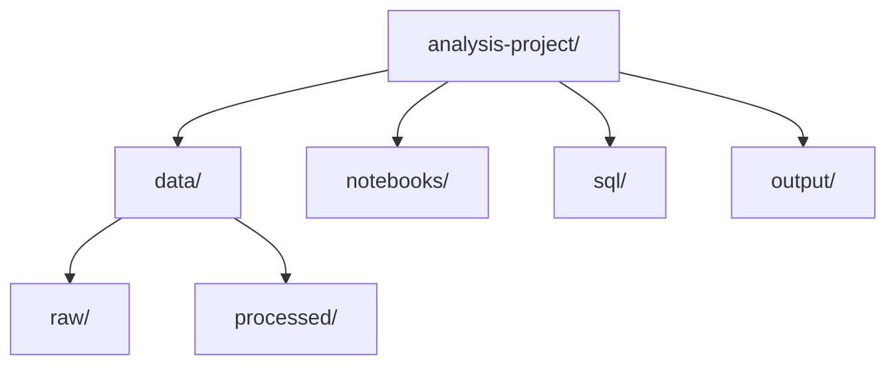

# Project Structure for Analysts

## 1. Why This Matters
Organising your analysis projects makes them reproducible and easy to share with teammates.

## 2. Core Concept
A typical analysis project folder:



```
analysis-project/
├── data/
│   ├── raw/
│   ├── processed/
│   └── README.md
├── notebooks/
│   ├── 01-exploration.ipynb
│   ├── 02-analysis.ipynb
│   └── 03-summary.ipynb
├── output/
│   ├── visualizations/
│   ├── dashboards/
│   └── reports/
├── sql/
│   ├── queries.sql
│   └── README.md
├── README.md
├── requirements.txt
└── .gitignore
```

## 3. Real-World Examples
• A marketing analyst stores all weekly campaign reports in `output/reports/`.
• A finance analyst uses `sql/` to keep reusable queries for P&L.

## 4. Comparison
| Folder | Content | When to use |
|--------|---------|-------------|
| data/raw | Original, immutable data | Always |
| data/processed | Cleaned, transformed data | After cleaning |
| notebooks/ | Jupyter notebooks for exploration | Interactive analysis |
| sql/ | .sql files for repeatable queries | When using SQL regularly |
| output/ | Charts, dashboards, PDFs | Sharing results |

## 5. Decision Tree
1. Is this a one-time analysis? Notebook may be enough.
2. Will you repeat this monthly? Build proper structure with SQL and scripts.
3. Sharing with others? Include README and output folder.

## 6. Common Misconceptions
• You don't need a complex structure for a quick exploration.
• The `data/raw` folder should never be edited – always create `processed`.

## 7. FAQ
**Q: Should I version control my data?** Only small datasets. Use `.gitignore` for large files.
**Q: How to document data?** Include a `data/README.md` describing source, columns, and any processing.

## 8. Next Steps
Learn GitHub fundamentals for analysts next.

## 9. Running Example
We'll build a real estate market analysis project using this structure. `data/raw/` will contain the original CSV. `notebooks/` will have EDA and visualisation. `output/dashboards/` will store the final Tableau/Power BI file.

## 10. Interview Prep
1. Why is it important to keep raw data read-only?
2. How would you structure a recurrent monthly sales report project?

