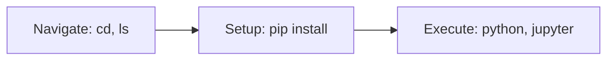

# Terminal Basics for Analysts

## 1. Why This Matters
Even analysts need basic command line skills to run scripts, install packages, and navigate files.

## 2. Core Concept
Essential commands: `ls`, `cd`, `pwd`, `mkdir`, `pip install`, `python script.py`, `jupyter notebook`. That's enough for 90% of analyst work.

## 3. Real-World Examples
• `cd projects/real-estate` → navigate to your project.
• `pip install pandas matplotlib` → install packages.
• `jupyter notebook` → launch Jupyter.
• `python report.py` → run a reporting script.

## 4. Comparison
| Task | Command |
|------|---------|
| List files | `ls` (Mac/Linux), `dir` (Windows) |
| Change directory | `cd folder` |
| Go up one level | `cd ..` |
| Install package | `pip install package` |
| Run script | `python script.py` |

## 5. Decision Tree
1. Need to install a Python library? → `pip install`.
2. Need to start Jupyter? → `jupyter notebook`.
3. Need to organise files? → `mkdir`, `mv`, `cp`.

## 6. Common Misconceptions
• You don't need to be a terminal expert – just a handful of commands.
• If you're afraid, use a GUI file manager and only use terminal for `pip` and `jupyter`.

## 7. FAQ
**Q: What if I get 'command not found'?** The program is not installed or not in PATH.
**Q: Can I use PowerShell on Windows?** Yes, commands are similar but some differ (e.g., `ls` works, `dir` also works).

## 8. Next Steps
Learn SQL basics for analytics.

## 9. Running Example
You'll open terminal, navigate to your real estate project folder, create a virtual environment, install required packages, and launch Jupyter Notebook – all from the command line.

## 10. Interview Prep
1. How do you install a specific version of a package?
2. What does `cd ..` do?

