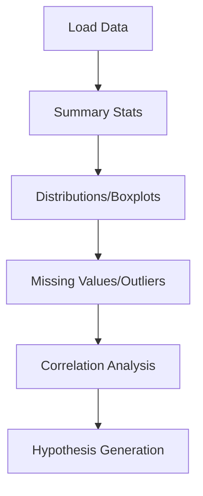

# Exploratory Data Analysis (EDA)

## 1. Why This Matters
Before any modelling or reporting, you need to understand your data. EDA reveals patterns, anomalies, and questions.

## 2. Core Concept
EDA involves:

- Summary statistics (mean, median, min, max)
- Distribution visualisations (histograms, boxplots)
- Missing value detection
- Correlation analysis
- Outlier detection

## 3. Real-World Examples
• Finding that most house sales happen in summer.
• Discovering that price has a long tail (few expensive properties).
• Noting that missing values in 'pool' indicate no pool.

## 4. Comparison
| Technique | What it shows | Example |
|-----------|---------------|---------|
| Histogram | Distribution of one variable | Price distribution |
| Boxplot | Spread and outliers | Price by property type |
| Scatter plot | Relationship between two | Price vs area |
| Correlation matrix | Linear relationships | Numeric columns |

## 5. Decision Tree
1. Understand a single column? → histogram, boxplot, summary stats.
2. Compare two columns? → scatter plot, grouped boxplot.
3. Many columns? → correlation matrix, pairplot.

## 6. Common Misconceptions
• EDA is not just plotting – it includes data cleaning and hypothesis generation.
• Correlation does not imply causation.

## 7. FAQ
**Q: How much time should I spend on EDA?** Up to 80% of project time is typical.
**Q: What tools for EDA?** Python (pandas, matplotlib, seaborn), R, or Tableau.

## 8. Next Steps
Learn data visualisation and storytelling next.

## 9. Running Example
You'll load the real estate dataset and perform EDA: check for missing values, plot price distribution, compare prices by property type, and create a correlation heatmap. You'll discover which features most influence price.

## 10. Interview Prep
1. You see a skewed distribution – what might cause it?
2. How do you handle outliers after detecting them?

