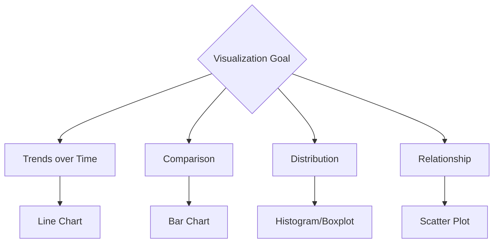

# Data Visualization & Storytelling

## 1. Why This Matters
A great analysis is useless if you can't communicate the insights. Visualisation and storytelling bridge the gap.

## 2. Core Concept
Choose the right chart for the message:

- Time series → line chart
- Comparison → bar chart
- Distribution → histogram/boxplot
- Proportion → pie/donut (use sparingly)
- Relationship → scatter plot
- Part-to-whole → stacked bar or waterfall
- Geography → map

## 3. Real-World Examples
• Showing quarterly sales growth with a line chart.
• Comparing revenue by product category with a bar chart.
• Highlighting a spike in cancellations after a price change (annotated line chart).

## 4. Comparison
| Chart | Best for | Common mistake |
|-------|----------|----------------|
| Bar | Comparing categories | Overusing 3D |
| Line | Trends over time | Missing axis labels |
| Scatter | Relationship | Overplotting (use alpha) |
| Histogram | Distribution | Wrong bin size |

## 5. Decision Tree
1. Showing change over time? → line chart
2. Comparing categories? → bar chart
3. Showing distribution? → histogram/boxplot
4. Showing proportion? → stacked bar (not pie for >2 categories)

## 6. Common Misconceptions
• More colours ≠ better – use colour purposefully.
• Always start y-axis at zero for bar charts (unless showing small differences).
• Pie charts are rarely the best choice.

## 7. FAQ
**Q: What tools can I use?** Tableau, Power BI, Python (matplotlib, seaborn, plotly), Excel.
**Q: How to tell a story with data?** Start with context, show the insight, explain why it matters, and recommend action.

## 8. Next Steps
Learn SQL basics for analytics next.

## 9. Running Example
Create a dashboard that tells the story of the housing market: line chart of median price over years, bar chart of average price by property type, map of location score vs price. Add annotations: 'luxury segment grew 15% in 2023'.

## 10. Interview Prep
1. You have to present a decline in sales – how would you visualise it?
2. What's wrong with using a pie chart for 20 categories?

