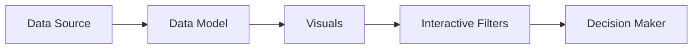

# Building Analytics Dashboards (Optional)

## 1. Why This Matters
Dashboards are how stakeholders consume your analysis. A well-designed dashboard drives decisions.

## 2. Core Concept
Dashboard = collection of visualisations, filters, and KPIs. Best practices: tell a story, keep it simple, use consistent colours, add filters for interactivity.

## 3. Real-World Examples
• Sales dashboard: revenue by region, top products, monthly trend.
• Marketing dashboard: conversion funnel, channel performance, ROI.
• Real estate dashboard: median price map, inventory by area, days on market trend.

## 4. Comparison
| Tool | Best for | Pros | Cons |
|------|----------|------|------|
| Tableau | Complex, beautiful dashboards | Powerful, interactive | Expensive, steep learning |
| Power BI | Microsoft shops | Good integration, cheaper | Windows only (mostly) |
| Looker | Modern data stacks | Embedded analytics | Costly |
| Python (Dash/Streamlit) | Custom apps | Free, flexible | Requires coding |

## 5. Decision Tree
1. Need free and custom? → Python Dash/Streamlit.
2. Team uses Excel/Office? → Power BI.
3. Need advanced visualisations and budget? → Tableau.
4. Company uses Google Cloud? → Looker.

## 6. Common Misconceptions
• Dashboards are not just pretty – they must answer business questions.
• Interactive filters are great, but too many can confuse users.

## 7. FAQ
**Q: How do I get data into a dashboard?** Connect directly to database, or use a CSV/Excel.
**Q: How often should I refresh?** Depends on data change frequency – hourly to monthly.

## 8. Next Steps
Continue to optional advanced topics or practice with your own dataset.

## 9. Running Example
Build a Tableau/Power BI dashboard for the real estate data: a map of average price by location, a bar chart of average days on market per property type, a line chart of sales over time, and filters for year and property type. Add KPIs: total sales, average price, median days on market.

## 10. Interview Prep
1. How would you design a dashboard for a sales manager?
2. What are the most important KPIs for an e-commerce business?

