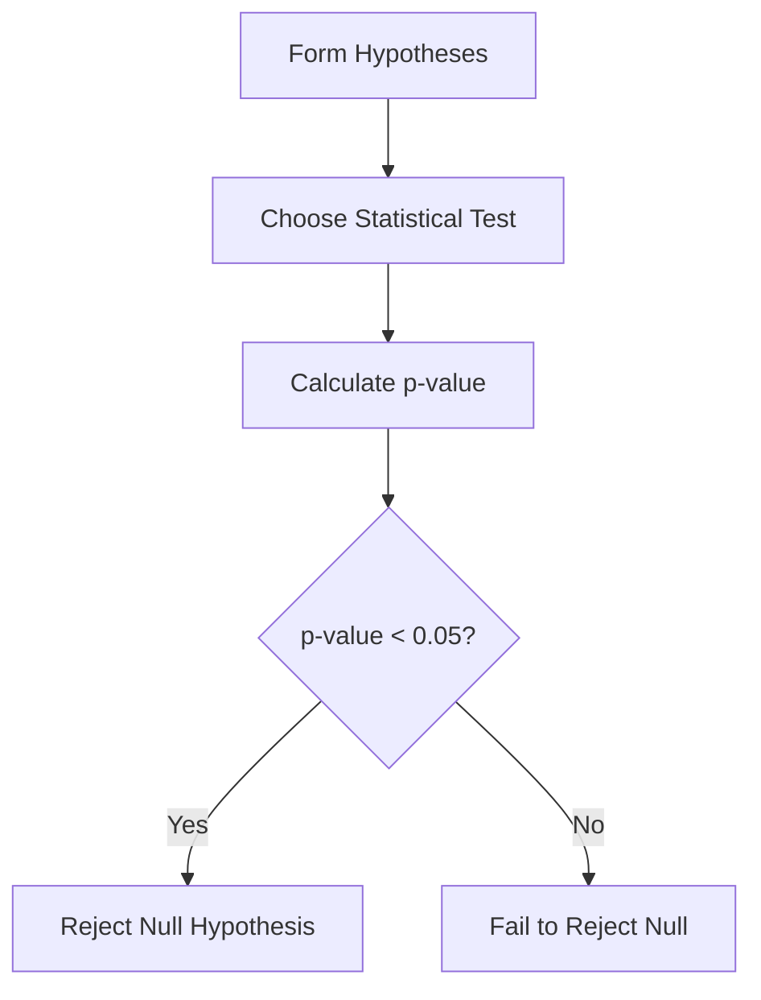

# Statistical Analysis & Testing (Optional)

## 1. Why This Matters
Statistics helps you make decisions under uncertainty – e.g., is the difference in house prices between two neighbourhoods significant or just random?

## 2. Core Concept
**Hypothesis testing**: null hypothesis (no effect) vs alternative. Use p-value to decide. Common tests: t-test (compare two means), chi-square (categorical), ANOVA (more than two groups). **Confidence intervals** give a range for an estimate.

## 3. Real-World Examples
• A/B test on website design: test if conversion rate increased.
• Compare average house price in two zip codes.
• Check if proportion of luxury homes changed after a policy.

## 4. Comparison
| Test | Data type | What it compares |
|------|-----------|------------------|
| t-test | Two numeric means | Two groups |
| ANOVA | Numeric means | Three+ groups |
| Chi-square | Categorical frequencies | Observed vs expected |
| Correlation test | Two numeric | Linear relationship |

## 5. Decision Tree
1. Compare two numeric groups? → t-test
2. Compare more than two groups? → ANOVA
3. Compare categorical proportions? → chi-square
4. Measure association between two numbers? → correlation test

## 6. Common Misconceptions
• p-value is not the probability that the null is true.
• Statistical significance does not imply practical significance (large sample can make tiny difference significant).

## 7. FAQ
**Q: What p-value threshold should I use?** Typically 0.05, but depends on field.
**Q: Do I need to be a statistician?** No, but understanding basics helps avoid mistakes.

## 8. Next Steps
Learn about building dashboards (optional).

## 9. Running Example
Test if houses with a pool have significantly higher prices than those without (t-test). Also test if the average price changed significantly between 2022 and 2023.

## 10. Interview Prep
1. Explain a p-value to a non-technical stakeholder.
2. What is the difference between a Type I and Type II error?

