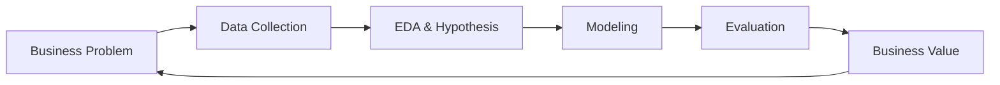

# Topic 0: Roles & Domains - The Data Scientist

## Overview
What does a Data Scientist actually do? Unlike a Data Analyst who focuses on "What happened?", a Data Scientist often asks "What will happen next?" and "How can we optimize this?".

## Key Concepts
- **Data Science vs. Data Analytics:** Transitioning from descriptive to predictive/prescriptive.
- **The Modern AI Stack:** Machine Learning, Deep Learning, and Generative AI.
- **Business Domains:** Finance, Healthcare, Retail, and Real Estate (our focus).

## Mermaid Diagram: Data Lifecycle

## Role Responsibilities
1. **Problem Framing:** Converting business vague needs into technical requirements.
2. **Feature Engineering:** Creating the "signals" that help models learn.
3. **Model Selection:** Choosing the right tool for the job.
4. **Experiment Tracking:** Ensuring results are reproducible.

## Summary
The Data Scientist acts as a bridge between complex mathematical algorithms and real-world business impact.
