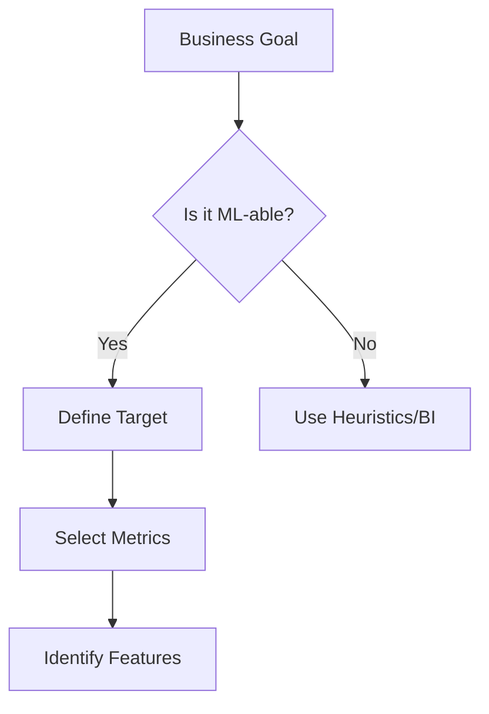

# Topic 1: Problem Framing & Scoping

## Overview
Success in data science begins before any code is written. Problem framing is the process of defining a business problem in terms that a machine learning model can address.

## SMART Objectives
- **Specific:** Predict house prices in the local market.
- **Measurable:** Achieve a Mean Absolute Error (MAE) under $20,000.
- **Achievable:** Use historical sale data with square footage (`area_sqft`) and location (`region`).
- **Relevant:** Help the sales team price inventory competitively.
- **Time-bound:** Deliver the baseline model within two weeks.

## Technical Translation
| Business Need | Machine Learning Task | Target Variable |
|---------------|-----------------------|-----------------|
| "How much will this house sell for?" | Regression | `price` |
| "Is this property overpriced?" | Classification | `is_overpriced` (binary) |

## Mermaid Diagram: Framing Process

## Running Example: House Price Prediction
We are tasked with predicting the sale price of properties. Our primary metric will be **Root Mean Squared Error (RMSE)** to penalize large errors.

## Deliverable
Check `scripts/problem_framing_demo.py` to see how we define these objectives in code.
