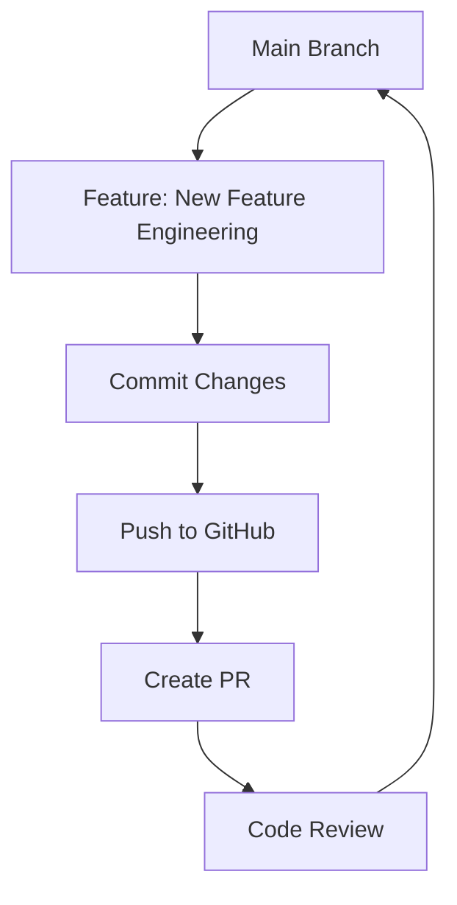

# Topic 3: GitHub Fundamentals for Data Science

## Overview
Git is not just for developers; it is the backbone of collaborative data science. It allows us to track changes in our scripts, collaborate with other researchers, and maintain a history of our modeling experiments.

## Key Git Concepts
- **Commits:** Atomic snapshots of your code and documentation.
- **Branches:** Isolated environments for trying new features or models.
- **Pull Requests (PRs):** The code review process where quality is ensured.
- **.gitignore:** Crucial for DS! It prevents large datasets (`.csv`) and model weights (`.pkl`) from being uploaded to GitHub.

## Mermaid Diagram: Git Flow

## .gitignore Best Practices
Always ignore:
- `data/` (except small metadata/schema)
- `venv/` or `env/`
- `.ipynb_checkpoints/`
- `mlruns/` (MLflow logs)
- `*.joblib` or `*.pkl` (Model files)

## Deliverables
- Check `.gitignore` in the root of this module.
- Practice by creating a branch: `git checkout -b feature/topic-3-basics`.

## Summary
Mastering Git ensures that your research is traceable and your collaboration is seamless.
