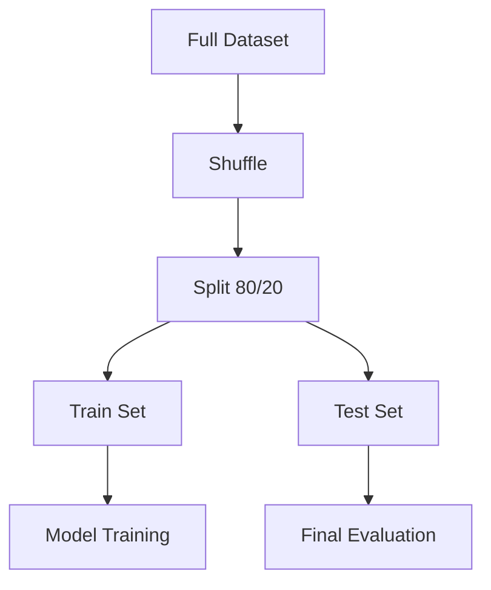

# Topic 10: Train-Test Split Deep Dive

## Overview
The most fundamental rule of Machine Learning is: **Never test on your training data.** This topic explores the nuances of how we split data to ensure our model generalizes to the real world.

## Common Splitting Strategies
1. **Random Split:** Standard for i.i.d. data (Independent and Identically Distributed).
2. **Stratified Split:** Ensures that categorical variables (like `region`) are represented in the same proportions in both sets.
3. **Temporal Split:** Crucial for time-series data (e.g., training on 2020-2022 data and testing on 2023).

## Data Leakage
Data leakage occurs when information from the test set "leaks" into the training set, leading to unrealistically high performance. 
- **Example:** Calculating the average price of the *entire* dataset and using it as a feature before splitting.

## Mermaid Diagram: Splitting Workflow

## Deliverables
Check `scripts/train_test_split_demo.py` for a comparison of different splitting techniques on the house price dataset.

## Summary
A rigorous train-test split is your best defense against building a model that only looks good on paper but fails in production.
