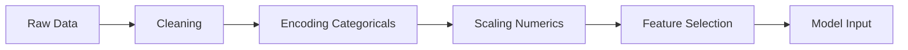

# Topic 5: Feature Engineering Strategy

## Overview
"Coming up with features is difficult, time-consuming, requires expert knowledge. 'Applied machine learning' is basically feature engineering." — Andrew Ng.

## What is Feature Engineering?
It is the process of using domain knowledge to create new input variables that help the model predict the target more accurately.

## Common Strategies
1. **Transformation:** Log-transforming skewed variables (like `price`).
2. **Creation:** `price_per_sqft` = `price` / `area_sqft` (useful for insights).
3. **Encoding:** Turning categorical variables like `region` into numbers (One-Hot Encoding).
4. **Aggregation:** Calculating the average price of houses of the same age (`age_years`).

## Mermaid Diagram: Engineering Pipeline

## Code Preview
We implement these transformations in `scripts/feature_engineering.py` using Scikit-Learn's `ColumnTransformer`.

## Summary
Better features often beat better algorithms. A simple Linear Regression with great features will outperform a complex Neural Network with poor ones.
