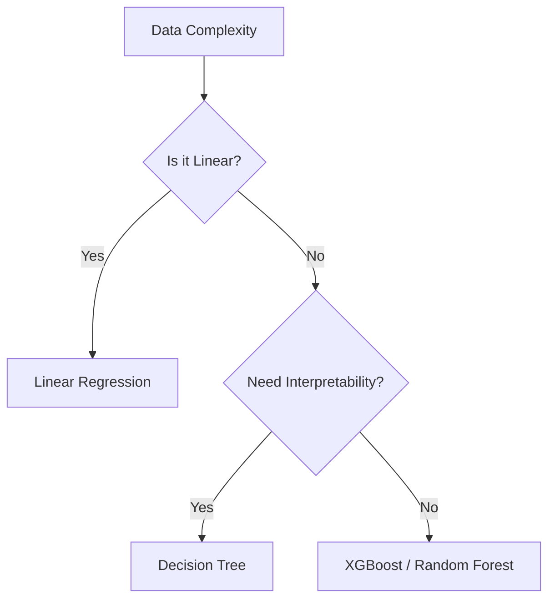

# Topic 6: Model Selection & Trade-offs

## Overview
Not all models are created equal. Choosing the right algorithm depends on the data size, the complexity of relationships, and the need for interpretability.

## Common Models for Regression
- **Linear Regression:** High interpretability, assumes linear relationships.
- **Decision Trees:** Non-linear, prone to overfitting.
- **Random Forest/XGBoost:** Ensemble methods, high accuracy, less interpretable.

## The Bias-Variance Trade-off
- **High Bias:** The model is too simple (Underfitting).
- **High Variance:** The model is too complex and sensitive to noise (Overfitting).

## Mermaid Diagram: Model Selection Logic

## Performance Metrics
- **MAE:** Mean Absolute Error (Easy to interpret).
- **RMSE:** Root Mean Squared Error (Penalizes outliers).
- **R²:** Coefficient of Determination (Variance explained).

## Summary
The "best" model is often the simplest one that meets your business performance threshold.
