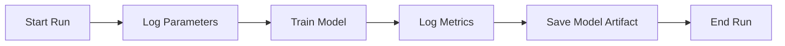

# Topic 7: Experiment Tracking & Reproducibility

## Overview
In a real-world DS project, you might train dozens of models. How do you remember which hyperparameters or features led to the best result? Experiment tracking solves this.

## Why Use Experiment Tracking?
- **Reproducibility:** Re-run any previous experiment exactly.
- **Comparison:** Side-by-side metric comparisons.
- **Collaboration:** Share results with your team easily.

## Our Tool: MLflow
We use **MLflow** for local tracking. It logs:
- **Parameters:** `learning_rate`, `n_estimators`, `max_depth`.
- **Metrics:** `RMSE`, `MAE`.
- **Artifacts:** The saved model file (`.pkl`) and feature importance plots.

## Mermaid Diagram: Tracking Workflow

## Code Preview
Check `scripts/experiment_tracking.py` to see how we wrap our training code in an MLflow context.

## Summary
Logging is not just for software engineers. For data scientists, it’s the difference between a one-off fluke and a reliable production model.
