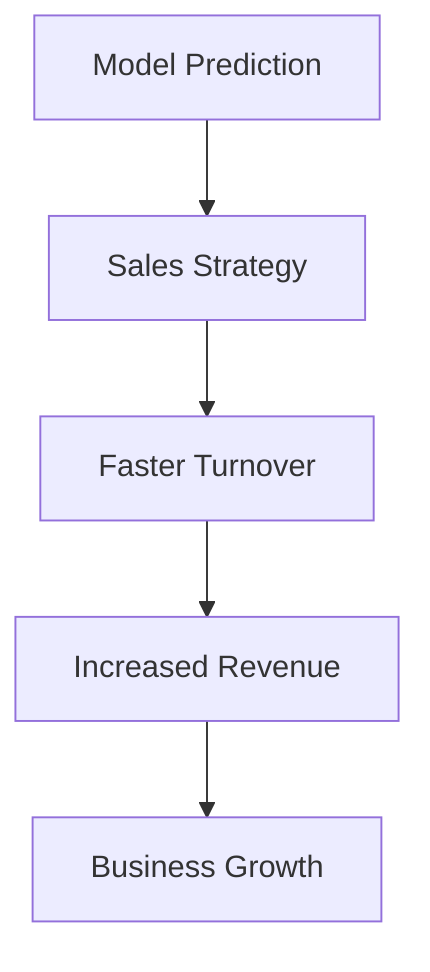

# Topic 8: Insights to Business Translation

## Overview
A model that predicts house prices is useless if the sales team doesn't know how to use it. Business translation is the art of converting model outputs into actionable advice.

## Key Translation Concepts
- **Feature Importance:** Which features drive the price the most? (e.g., "Location is 3x more influential than square footage.")
- **Error Context:** Where does the model fail? (e.g., "Our model is 10% less accurate for luxury villas over $1M.")
- **ROI Analysis:** How much money does this model save/make?

## ROI Calculation Example
If a manual appraiser is off by $30k on average, and our model is off by only $15k, we reduce pricing error by 50%. This could lead to faster sales and fewer price reductions.

## Mermaid Diagram: Impact Chain

## Deliverables
Run `scripts/business_impact_calculator.py` to see how we quantify the value of our predictions.

## Summary
The value of data science is measured in business outcomes, not just R² scores.
