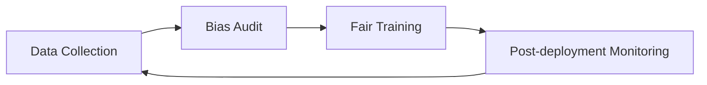

# Topic 9: Ethics, Fairness & Responsible AI

## Overview
Machine Learning models can perpetuate biases found in historical data. In real estate, this might mean unfairly lower price estimates for certain neighborhoods based on demographic factors rather than property value.

## Why Ethics Matter
- **Trust:** Users won't use a model they perceive as biased.
- **Legality:** Discriminatory models can violate fair housing laws.
- **Accuracy:** Bias is often a form of error that reduces overall model performance.

## Fairness Metrics
- **Demographic Parity:** Does the model predict similar average prices across different regions?
- **Equal Opportunity:** Are prediction errors distributed evenly across different property types?

## Mermaid Diagram: Responsible AI Loop

## Deliverables
Check `scripts/fairness_audit.py` to see how we evaluate our model for disparate impact across different regions.

## Summary
Responsible AI is not a checkbox at the end; it is a mindset that starts at data collection.
