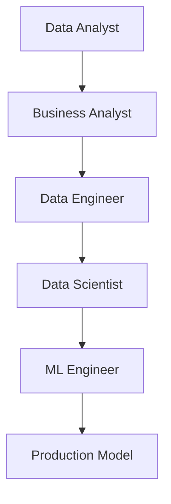

# Roles & Domains in Data Science

## 1. Why This Matters
Knowing the data science landscape helps you choose your career path and communicate with stakeholders. In our house price project, you'll act as a Data Scientist.

## 2. Core Concept
**Data Scientist**: builds predictive models. **ML Engineer**: productionizes models, builds pipelines. **Data Analyst**: answers business questions with dashboards. **Business Analyst**: translates business needs into data requirements. **Data Engineer**: builds data infrastructure.

## 3. Real-World Examples
Netflix uses Data Scientists for recommendations, Data Engineers for pipeline, and ML Engineers to serve models in real time. Airbnb uses ML Engineers to deploy pricing models.

## 4. Comparison / Visualization
| Role | Coding | Stats | Business | Tools |
|------|--------|-------|----------|-------|
| Data Scientist | High | High | Medium | Python, SQL, scikit-learn |
| ML Engineer | Very High | Medium | Low | Docker, Kubernetes, TFX |
| Data Analyst | Medium | Medium | High | SQL, Tableau, Excel |
| Business Analyst | Low | Low | Very High | Excel, Power BI |

## 5. Decision Tree
1. Love building models? → Data Scientist/ML Engineer
2. Love finding insights? → Data Analyst
3. Love strategy & meetings? → Business Analyst
4. Love infrastructure? → Data Engineer

## 6. Common Misconceptions
• Data Scientists must know everything – no, specialisation is fine.
• ML Engineer is just a coder – they need ML knowledge too.
• Data Analyst is a junior Data Scientist – different focus.

## 7. FAQ
**Q: Can I switch roles later?** Yes, many people move between them.
**Q: Which role pays most?** Senior ML Engineer / Data Scientist (similar).
**Q: Do I need a PhD?** No, many roles accept a Master's or even Bachelor's with experience.

## 8. Next Steps
Explore the ML subfields topic next. Then read about supervised vs unsupervised learning.

## 9. Running Example (House Price Prediction)
Throughout this repo, you will build a machine learning model to predict house prices. You'll start with data exploration, then train a regression model, and finally deploy it with Streamlit. The dataset includes features like area, bedrooms, location score, and more.

## 10. Interview Prep Questions
1. What's the difference between a Data Analyst and a Business Analyst?
2. Describe a project where you worked with cross-functional teams.
3. How would you explain a random forest to a non-technical stakeholder?

