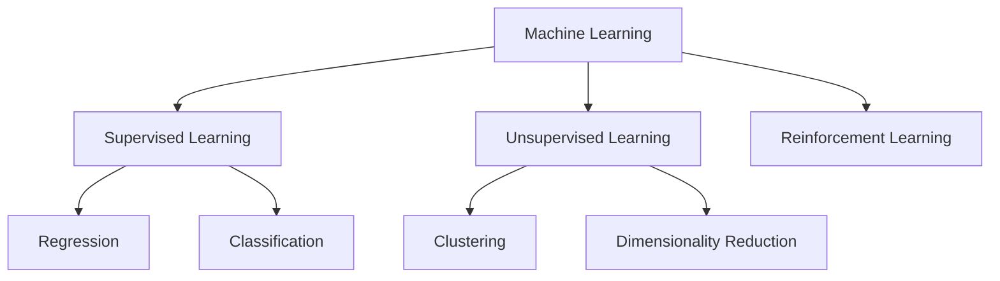

# Machine Learning Subfields

## 1. Why This Matters
ML is a broad field. Knowing the subfields helps you specialise and understand what's possible. In our project, we'll focus on supervised learning (regression).

## 2. Core Concept
**Supervised Learning**: learn from labeled data (e.g., house price prediction). **Unsupervised Learning**: find patterns in unlabeled data (e.g., customer segmentation). **Reinforcement Learning**: learn from rewards/punishments (e.g., game AI). **Semi-supervised**: mix of labeled and unlabeled.

## 3. Real-World Examples
• Supervised: spam detection, credit scoring, house price prediction.
• Unsupervised: customer segmentation, anomaly detection.
• Reinforcement: self-driving cars, robotics, recommendation systems.

## 4. Comparison
| Subfield | Labeled data needed | Common algorithms | Use case |
|----------|---------------------|-------------------|----------|
| Supervised | Yes | Linear regression, random forest | Prediction |
| Unsupervised | No | K-means, PCA | Pattern discovery |
| Reinforcement | No (reward signal) | Q-learning, PPO | Sequential decisions |

## 5. Decision Tree
1. Have labeled data? → Supervised
2. No labels, want groupings? → Unsupervised
3. Learning from actions in an environment? → Reinforcement
4. Some labels but mostly unlabeled? → Semi-supervised

## 6. Common Misconceptions
• Reinforcement learning is not just for games – it's used in finance, healthcare, robotics.
• Unsupervised learning is not 'easier' than supervised – evaluation is tricky.
• You don't need deep learning for everything – simpler models often work better.

## 7. FAQ
**Q: Which subfield should I learn first?** Supervised learning – it's the most common in industry.
**Q: Is deep learning a separate subfield?** It's a technique used across all subfields.

## 8. Next Steps
Read the 'Modern AI Concepts' topic next to see how these subfields evolve.

## 9. Running Example
Our house price prediction is a **supervised learning** problem (regression). Later, you could apply unsupervised learning to segment similar houses.

## 10. Interview Prep
1. Give an example of a supervised and unsupervised problem.
2. When would you choose reinforcement learning over supervised learning?

