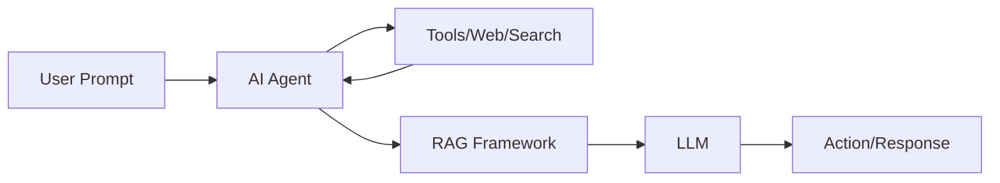

# Modern AI Concepts (RAG, Agents, LLMs)

## 1. Why This Matters
Recent advances like ChatGPT have changed how we build AI. Understanding RAG, agents, and LLMs helps you stay current. Our project doesn't use them, but you'll be ready for future extensions.

## 2. Core Concept
**LLM (Large Language Model)**: model trained on vast text to generate human-like text. **RAG (Retrieval-Augmented Generation)**: LLM + external knowledge retrieval. **AI Agent**: autonomous system that uses tools (e.g., web search, calculator) to achieve goals.

## 3. Real-World Examples
• RAG: ChatGPT with browsing, company internal QA bot.
• Agents: AutoGPT, coding assistants that run commands.
• LLMs: content generation, summarisation, code completion.

## 4. Comparison
| Concept | Knowledge source | Capabilities | Complexity |
|---------|------------------|--------------|------------|
| Basic LLM | Training data only | Text generation, conversation | Medium |
| RAG | Training + external DB | Factual grounding, up-to-date answers | High |
| Agent | LLM + tools + planning | Multi-step tasks, actions | Very High |

## 5. Decision Tree
1. Need factual, current answers? → RAG
2. Need to perform actions (send emails, browse web)? → Agent
3. Simple chat or content creation? → Basic LLM

## 6. Common Misconceptions
• RAG is not a separate model – it's a framework around an LLM.
• Agents are not 'sentient' – they follow rules and prompts.
• LLMs don't 'understand' – they predict next words.

## 7. FAQ
**Q: Do I need to learn LLMs to be a data scientist?** Not yet, but it's becoming valuable.
**Q: Can I build RAG at home?** Yes, with open-source models and vector databases.

## 8. Next Steps
Continue to the ML Fundamentals section (data types, supervised vs unsupervised).

## 9. Running Example
Imagine extending our house price prediction with an AI agent that automatically scrapes new property data and retrains the model – that's an agent use case.

## 10. Interview Prep
1. Explain RAG in two sentences.
2. What's the difference between an LLM and an AI agent?

