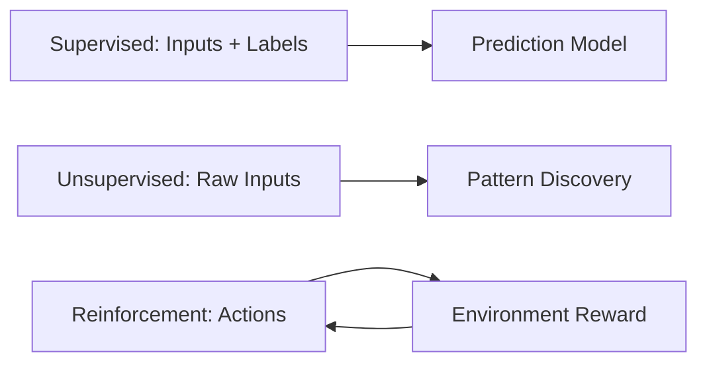

# Supervised vs Unsupervised vs Reinforcement

## 1. Why This Matters
Choosing the right learning paradigm is the first step in any ML project.

## 2. Core Concept
**Supervised**: learn mapping from X to y using labeled pairs. **Unsupervised**: find structure in X alone. **Reinforcement**: learn from rewards to maximise cumulative return.

## 3. Real-World Examples
• Supervised: credit scoring, fraud detection.
• Unsupervised: market basket analysis, customer segments.
• Reinforcement: game AI (AlphaGo), robot control.

## 4. Comparison
| Aspect | Supervised | Unsupervised | Reinforcement |
|--------|------------|--------------|---------------|
| Data | (X, y) | X only | (state, action, reward) |
| Goal | Predict y | Discover patterns | Maximise reward |
| Feedback | Immediate (correct output) | None | Delayed (reward) |

## 5. Decision Tree
1. Have labeled data? → Supervised
2. No labels but want groups? → Unsupervised
3. Learning from interaction with environment? → Reinforcement

## 6. Common Misconceptions
• Reinforcement learning is not the same as unsupervised learning – it has a reward signal.
• Unsupervised can be used as a preprocessing step for supervised (e.g., clustering then classification).

## 7. FAQ
**Q: Which one is easiest to start?** Supervised – it's well-defined.
**Q: Can I combine them?** Yes, e.g., using unsupervised pre-training then supervised fine-tuning.

## 8. Next Steps
Read regression vs classification next.

## 9. Running Example
House price prediction is **supervised learning** (regression). If we wanted to segment houses into luxury vs economy without price, that would be unsupervised (clustering).

## 10. Interview Prep
1. Give a business problem for each paradigm.
2. How would you formulate a self-driving car as reinforcement learning?

