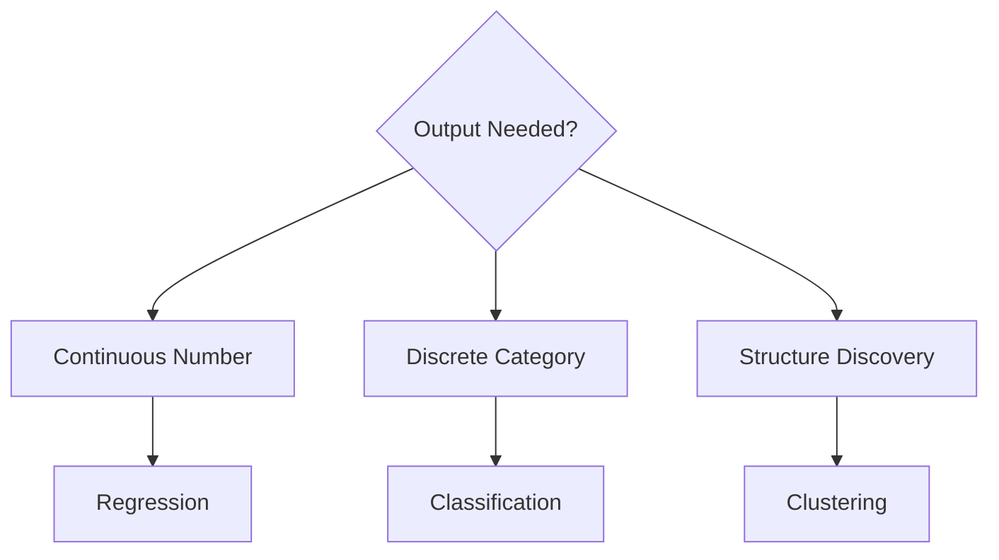

# Regression vs Classification vs Clustering

## 1. Why This Matters
These are the most common task types in supervised and unsupervised learning.

## 2. Core Concept
**Regression**: predict continuous numeric value (e.g., price). **Classification**: predict discrete class (e.g., house style). **Clustering**: group similar examples without labels (e.g., market segments).

## 3. Real-World Examples
• Regression: stock price, temperature, sales forecast.
• Classification: spam detection, image recognition, loan default (yes/no).
• Clustering: customer segmentation, document grouping.

## 4. Comparison
| Task | Output type | Evaluation | Example algorithm |
|------|-------------|------------|-------------------|
| Regression | Continuous | MSE, MAE | Linear regression, Random Forest |
| Classification | Discrete | Accuracy, F1 | Logistic regression, SVM |
| Clustering | Cluster IDs | Silhouette score | K-means, DBSCAN |

## 5. Decision Tree
1. Want a number? → Regression
2. Want a category? → Classification
3. Want to discover groups without labels? → Clustering

## 6. Common Misconceptions
• Classification with two classes is not 'regression with a threshold' – models differ.
• Clustering is not 'unsupervised classification' – there is no ground truth to compare.

## 7. FAQ
**Q: Can regression be used for classification?** In binary case, logistic regression is a classification algorithm – not linear regression.
**Q: How many clusters should I choose?** Use elbow method or silhouette score.

## 8. Next Steps
Move to the Technical Foundation section (IDEs, project structure).

## 9. Running Example
Our main task is **regression** (price). But you could also do classification: predict whether a house sells within 30 days (yes/no). Clustering could group houses into 'luxury', 'mid-range', 'budget' without using price.

## 10. Interview Prep
1. Explain the difference between regression and classification with an example.
2. How would you evaluate a clustering result?

