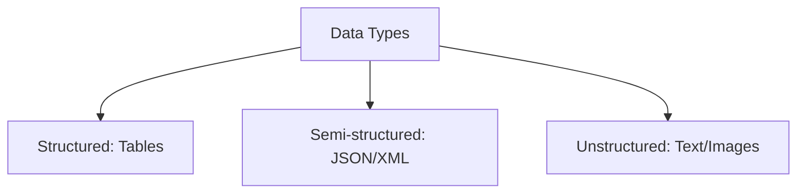

# Data Types - Structured, Unstructured, Semi-structured

## 1. Why This Matters
Different data types require different tools and preprocessing. Our house price dataset is structured – but real-world data is messy.

## 2. Core Concept
**Structured**: tabular (rows & columns). **Unstructured**: text, images, audio. **Semi-structured**: JSON, XML (has tags/keys but not rigid schema).

## 3. Real-World Examples
• Structured: SQL databases, Excel sheets.
• Unstructured: emails, social media posts, MRI scans.
• Semi-structured: API responses (JSON), log files.

## 4. Comparison
| Type | Schema | Query ease | ML techniques |
|------|--------|------------|---------------|
| Structured | Fixed | Easy (SQL) | Regression, trees |
| Semi-structured | Flexible | Medium (JSON paths) | Feature extraction |
| Unstructured | None | Hard | Deep learning, NLP |

## 5. Decision Tree
1. Is it rows & columns? → Structured
2. Does it have tags/keys but not fixed? → Semi-structured
3. Raw text, images, or audio? → Unstructured

## 6. Common Misconceptions
• Semi-structured is not 'unstructured' – it does have some organisation.
• You can convert unstructured to structured (e.g., image -> pixel table) but lose meaning.

## 7. FAQ
**Q: Which type is most common in industry?** Structured, but unstructured is growing rapidly.
**Q: Do I need different libraries?** Yes, e.g., OpenCV for images, NLTK for text.

## 8. Next Steps
Learn about labeled vs unlabeled data next.

## 9. Running Example
Our house price dataset is **structured** (CSV). But imagine also having property descriptions (text) – that would be unstructured, and you could use NLP to improve predictions.

## 10. Interview Prep
1. Give an example of each data type in e-commerce.
2. How would you handle semi-structured data like JSON?

