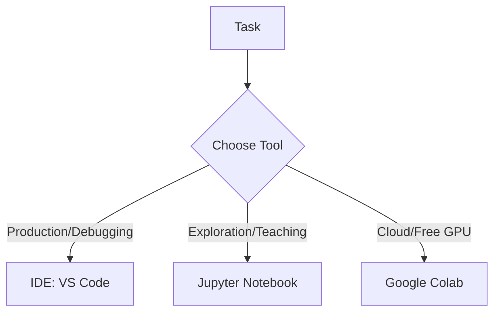

# IDE vs Jupyter vs Colab

## 1. Why This Matters
Choosing the right environment speeds up your workflow. For our project, we'll use Jupyter for exploration and a proper IDE for production code.

## 2. Core Concept
**IDE** (VS Code, PyCharm): full-featured code editor with debugger, terminal, version control. **Jupyter Notebook**: interactive, cell-based – great for exploration and teaching. **Colab**: cloud Jupyter with free GPU.

## 3. Real-World Examples
• Research: Jupyter or Colab.
• Production code: IDE.
• Teaching: Jupyter (easy to mix text and code).

## 4. Comparison
| Feature | IDE | Jupyter | Colab |
|---------|-----|---------|-------|
| Interactivity | Medium | High | High |
| Debugging | Excellent | Basic | Basic |
| Collaboration | Via Git | Via Git | Real-time sharing |
| GPU | No (local) | No (local) | Free GPU |

## 5. Decision Tree
1. Need heavy debugging, large projects? → IDE
2. Exploring data, teaching, prototyping? → Jupyter
3. Need free GPU and cloud? → Colab

## 6. Common Misconceptions
• You don't have to choose one – many people use both (Jupyter for EDA, IDE for final script).
• Colab is not just for beginners – researchers use it for quick experiments.

## 7. FAQ
**Q: Can I use Git with Jupyter?** Yes, but notebooks can cause merge conflicts – use `nbdime`.
**Q: Is Colab enough for professional work?** For small models and prototyping, yes. For large-scale training, use proper cloud (AWS, GCP).

## 8. Next Steps
Read about project structure to organise your code.

## 9. Running Example
We'll start by exploring the dataset in **Jupyter Notebook** (or Colab). Later, we'll move the final model to a Python script using an **IDE** (VS Code).

## 10. Interview Prep
1. When would you prefer Jupyter over an IDE?
2. What are the limitations of Colab?

