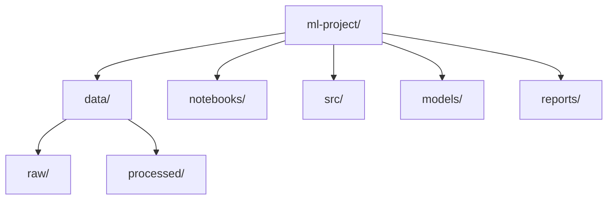

# Project Structure for ML

## 1. Why This Matters
A consistent project structure makes your work reproducible, shareable, and professional.

## 2. Core Concept
A typical ML project folder:



```
ml-project/
├── data/
│   ├── raw/
│   ├── processed/
│   └── external/
├── notebooks/   (exploration)
├── src/         (code modules)
├── models/      (saved models)
├── reports/     (figures, results)
├── requirements.txt
├── README.md
└── .gitignore
```

## 3. Real-World Examples
• Kaggle competition templates.
• Cookie-cutter data science.
• Your own projects – adopt one style and stick to it.

## 4. Comparison
| Component | Purpose | Example files |
|-----------|---------|---------------|
| data/raw | Immutable source data | house_prices.csv |
| data/processed | Cleaned, engineered data | X_train.csv, y_train.csv |
| notebooks/ | EDA, experimentation | 01-explore.ipynb |
| src/ | Reusable code | preprocess.py, train.py |
| models/ | Saved models | random_forest.pkl |

## 5. Decision Tree
1. Is it a small one-off analysis? Notebook may be enough.
2. Planning to share or deploy? Use full project structure.
3. Working in a team? Mandatory.

## 6. Common Misconceptions
• You don't need a complex structure for a quick prototype.
• The structure is not fixed – adapt to your needs.

## 7. FAQ
**Q: Where do I put configuration files?** Create a `config/` folder or use environment variables.
**Q: How to handle large data?** Use `data/` with symlinks to external storage, or add to `.gitignore`.

## 8. Next Steps
Learn terminal basics next – you'll need it to run scripts and manage projects.

## 9. Running Example
Our house price project will follow this exact structure. You'll find the dataset in `data/raw/`, notebooks in `notebooks/`, and final model in `models/`.

## 10. Interview Prep
1. Why is it important to keep raw data immutable?
2. How do you manage dependencies in an ML project?

