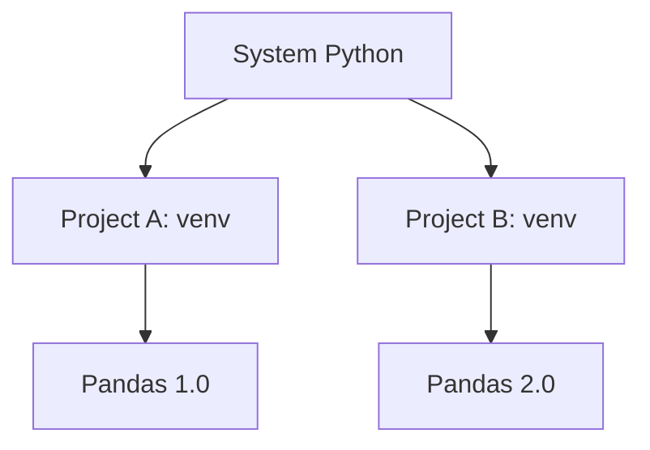

# Virtual Environments

## 1. Why This Matters
Virtual environments isolate dependencies for different projects. Without them, you'd get version conflicts all the time.

## 2. Core Concept
A virtual environment is a self-contained directory that holds a specific Python version and packages. Use `venv` (built-in) or `conda` (Anaconda).

## 3. Real-World Examples
• Project A needs pandas 1.0, Project B needs pandas 2.0 – virtual envs solve this.
• Sharing a `requirements.txt` lets others recreate your environment.

## 4. Comparison
| Tool | Built-in | Cross-platform | Environment file |
|------|----------|----------------|------------------|
| venv | Yes | Yes | requirements.txt |
| conda | No (Anaconda) | Yes | environment.yml |
| poetry | No | Yes | pyproject.toml |

## 5. Decision Tree
1. Using only Python and pip? → `venv`
2. Need different Python versions or non-Python libraries (e.g., CUDA)? → `conda`
3. Building a library? → `poetry`

## 6. Common Misconceptions
• Virtual environments are not heavy – they mainly contain symlinks.
• You should never install packages globally for project work.

## 7. FAQ
**Q: Can I move a virtual environment?** Not easily – better to recreate with `requirements.txt`.
**Q: Do I need a virtual environment for a simple script?** It's good practice, but for a one-off script you can skip.

## 8. Next Steps
Learn GitHub fundamentals next.

## 9. Running Example
We'll create a `requirements.txt` for our house price project. You'll activate the environment before running any code, ensuring everyone gets the same package versions.

## 10. Interview Prep
1. How do you create and activate a virtual environment?
2. Why is `requirements.txt` important for collaboration?

