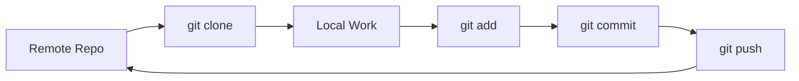

# GitHub Fundamentals

## 1. Why This Matters
GitHub is where you share code, collaborate, and build your portfolio. Every data scientist should know basic Git.

## 2. Core Concept
**Git**: version control system. **GitHub**: cloud hosting for Git repos. Basic workflow: `clone`, `add`, `commit`, `push`, `pull`, `branch`.

## 3. Real-World Examples
• Collaborate on a model with teammates.
• Track changes to your analysis.
• Showcase your house price project on GitHub for recruiters.

## 4. Comparison
| Command | Purpose |
|---------|---------|
| git clone <url> | Download a repo |
| git add . | Stage changes |
| git commit -m "msg" | Save snapshot |
| git push | Upload to GitHub |
| git pull | Download latest |
| git checkout -b new | Create branch |

## 5. Decision Tree
1. Working alone? Still use Git – it's a time machine.
2. Working with others? Use branches and pull requests.
3. Need to undo something? `git revert` or `git reset`.

## 6. Common Misconceptions
• Git is not the same as GitHub – Git is the tool, GitHub is a hosting service.
• You don't need to memorise every command; start with the basic 5-6.

## 7. FAQ
**Q: Can I use GitHub for large files (datasets)?** Use Git LFS or store data elsewhere and reference it.
**Q: How to handle Jupyter notebooks in Git?** They can cause merge conflicts – use `nbdime` or export to HTML.

## 8. Next Steps
Read about train-test split next.

## 9. Running Example
You'll upload the entire house price project to GitHub. Include a `.gitignore` to exclude `data/raw/` (if large) and `models/`. This becomes your portfolio piece.

## 10. Interview Prep
1. Explain the difference between `git pull` and `git fetch`.
2. What is a merge conflict and how do you resolve it?

