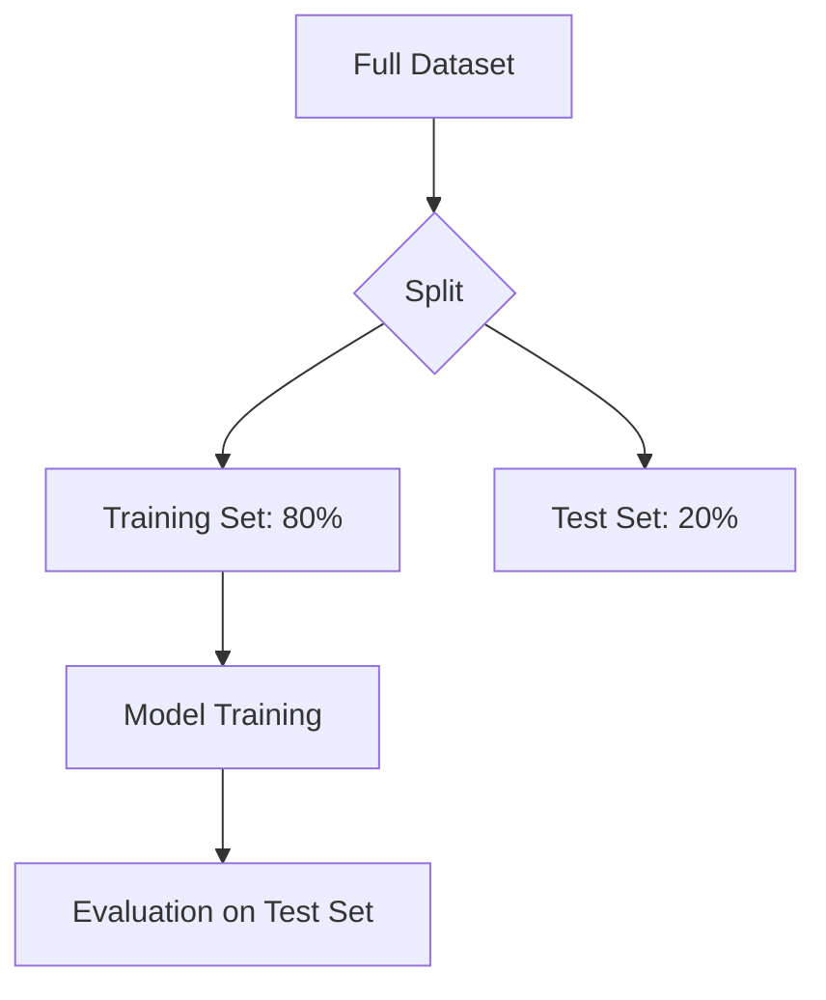

# Train-Test Concepts

## 1. Why This Matters
You need to evaluate your model on unseen data to know if it generalises. Train-test split is the simplest way.

## 2. Core Concept
Split data into training (e.g., 80%) and testing (20%). Train on training set, evaluate on test set. Never use test data during training – that's cheating.

## 3. Real-World Examples
• Predicting house prices: train on 440 houses, test on 110.
• Classification: split into train and test to measure accuracy on new emails.

## 4. Comparison
| Technique | When to use | Advantage | Disadvantage |
|-----------|-------------|-----------|---------------|
| Simple split | Large dataset | Fast | High variance |
| K-fold CV | Smaller dataset | More robust | Computationally expensive |
| Stratified split | Imbalanced classes | Preserves class distribution | Requires care |

## 5. Decision Tree
1. Have millions of samples? → Simple split (80/20)
2. Have <10k samples? → K-fold cross-validation
3. Classes imbalanced? → Stratified split

## 6. Common Misconceptions
• Test set is not 'validation set' – you should have a separate validation set for tuning.
• Random state ensures reproducibility – always set it.

## 7. FAQ
**Q: What if I accidentally train on test data?** Your performance estimate will be too optimistic – you'll be disappointed in production.
**Q: How to split time-series data?** Don't shuffle – use chronological split.

## 8. Next Steps
Read about model selection next.

## 9. Running Example
We'll split our 550 houses into training (440) and testing (110). We'll use `train_test_split` from scikit-learn with `random_state=42`. The final evaluation will be on the test set only.

## 10. Interview Prep
1. Why do we need a separate test set?
2. What is data leakage and how can it happen with train-test split?

