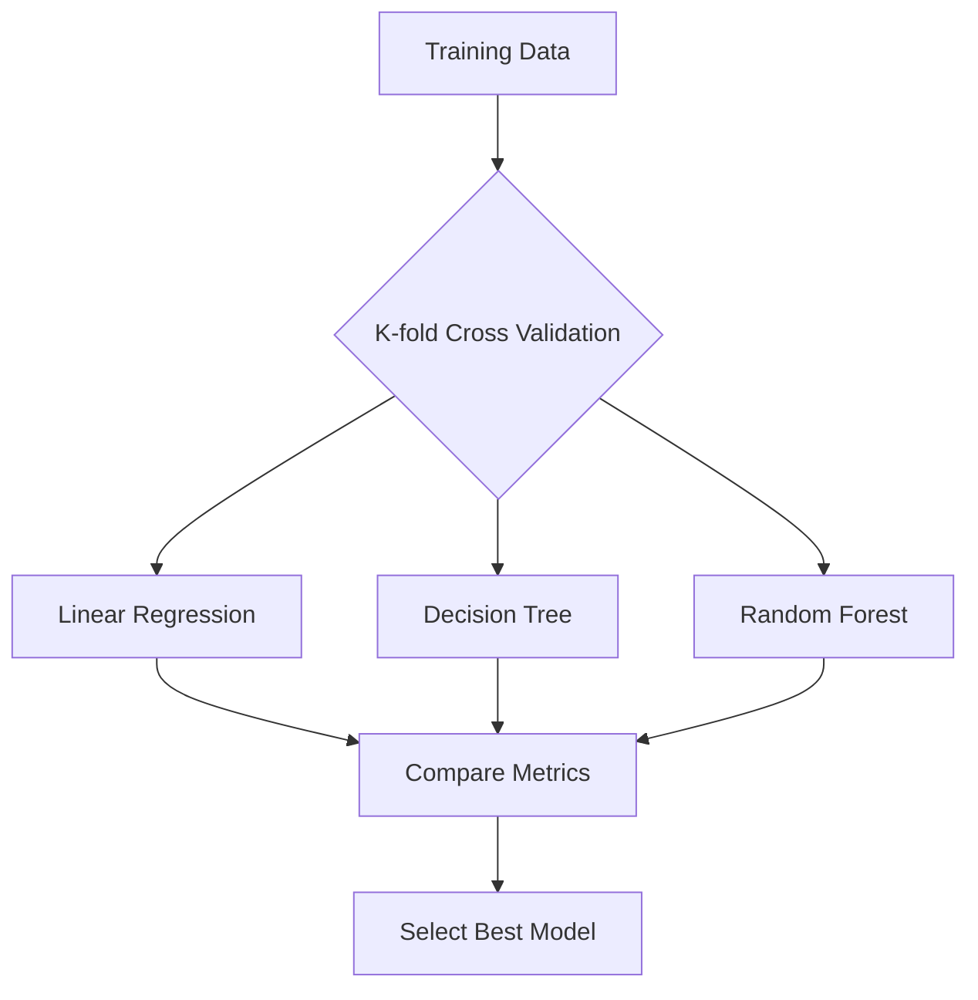

# Model Selection

## 1. Why This Matters
No single model works best for all problems. Model selection helps you choose the right algorithm and hyperparameters.

## 2. Core Concept
Model selection involves comparing different algorithms (e.g., linear regression vs random forest) and tuning hyperparameters. Use cross-validation on the training set, then evaluate the best model on the test set.

## 3. Real-World Examples
• Try linear regression, decision tree, random forest, and gradient boosting.
• Use grid search or random search to find best hyperparameters.

## 4. Comparison
| Method | Search type | Best for |
|--------|-------------|----------|
| Grid search | Exhaustive over parameter grid | Small parameter space |
| Random search | Random samples | Large space, faster |
| Bayesian opt. | Probabilistic model | Expensive evaluations |

## 5. Decision Tree
1. Have <10 parameters? → Grid search.
2. Have many parameters or large ranges? → Random search.
3. Each evaluation takes hours? → Bayesian optimisation.

## 6. Common Misconceptions
• More complex model does not mean better – often a simple model generalises better.
• You cannot use test set for model selection – that would overfit to test.

## 7. FAQ
**Q: How do I avoid overfitting during selection?** Use cross-validation, not a single validation set.
**Q: What is the bias-variance tradeoff?** Simple models have high bias, complex models have high variance.

## 8. Next Steps
Learn about deployment with Streamlit.

## 9. Running Example
We will compare linear regression, decision tree, and random forest for house price prediction. Using 5-fold cross-validation, we'll choose the best model and then evaluate on the test set.

## 10. Interview Prep
1. Explain cross-validation in one minute.
2. How do you choose between random forest and gradient boosting?

